# MP Seller Tools

**One place to run a multichannel store: a catalog, stock, orders and listings
for Amazon, eBay, Walmart, Magento and your own website.**

MP Seller Tools is a multi-tenant seller platform. A platform console manages a
registry of companies, and every company gets its own workspace, running as its
own application process against its own SQL Server database.


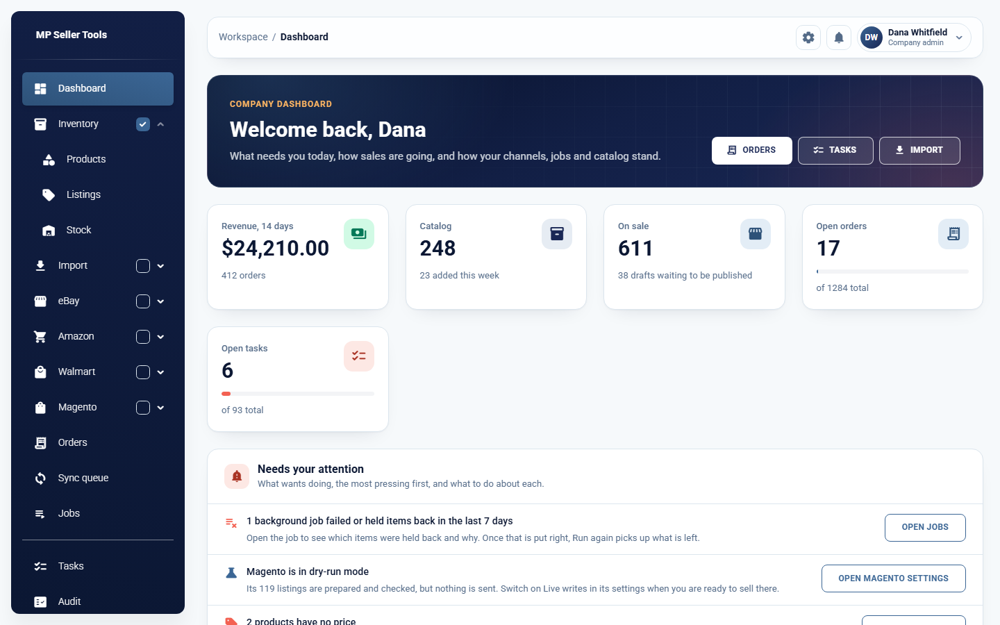

<details>
<summary>The whole dashboard</summary>

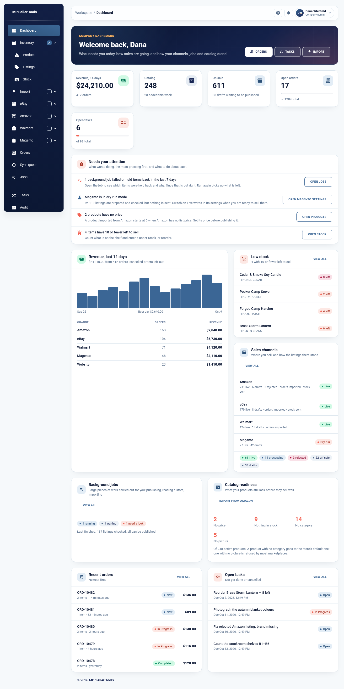

</details>

## Features

### Company workspace

For a company's administrators and employees.

- **Catalog** — products with variants (own SKU, price and stock), pictures,
  brands, categories and barcodes; import from a file with a check before
  anything is saved.
- **Sales channels** — Amazon, eBay, Walmart, a Magento store and the company's
  own website, each with its own content, price, quantity cap and pictures per
  listing, and a pre-publish check that says what is still missing.
- **Import from Amazon** — make products out of Amazon's catalog, one item at a
  time (found by name, ASIN or barcode) or a pasted list in bulk.
- **Stock** — on hand, held for orders, safety stock and what is left to sell,
  with stock counts, returns, a movement ledger and low-stock alerts.
- **Orders and tasks** — orders from every channel in one list, assigned to
  people, with tasks alongside.
- **Sync queue and bulk jobs** — changes reach the channels through a queue
  with retries and a visible reason for every failure; large pieces of work
  (publish every draft, check every listing, read a store) run in the
  background with progress.
- **Magento** — connection test, the store's categories mapped to yours, and
  removal of a store's products by SKU prefix.
- **Dashboard** — what needs doing first, then revenue by day and by channel,
  each sales channel's listings, background jobs, catalog readiness and low
  stock.
- **Users** — added with a password (or by invitation, where a host switches
  `Features:InvitationsEnabled` on), roles, blocking, password resets, bulk actions,
  activity and an audit log.

### Platform console

For the platform administrator.

- Create, rename, suspend, resume, restart and delete companies; each one gets
  its own database and its own running instance.
- See every company's status, address, port, database and process.
- Manage the users of any company through that company's own instance.
- Provisioning job history, audit log and export of the company list.

### Both

- Named themes with light and dark mode, saved to each user's profile.
- A notification history in the top bar, where a standing problem stays in red
  until it is resolved and a finished background job is announced.
- HTTPS only, HttpOnly + Secure + SameSite=Strict cookies, antiforgery tokens,
  account lockout, and marketplace credentials encrypted at rest.

## Screenshots

The data in these pictures is made up.

| | |
| --- | --- |
| 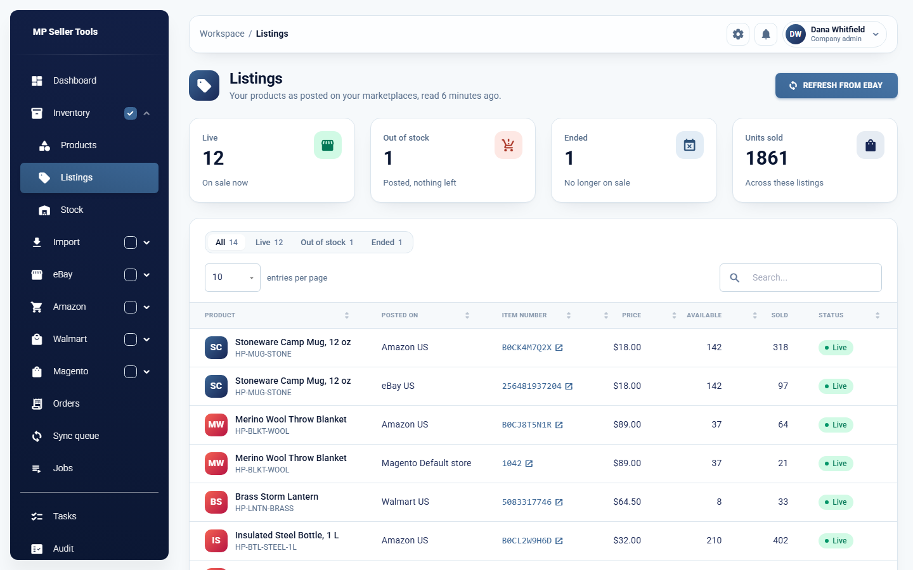 **Listings** — what is posted, where, and how it sells | 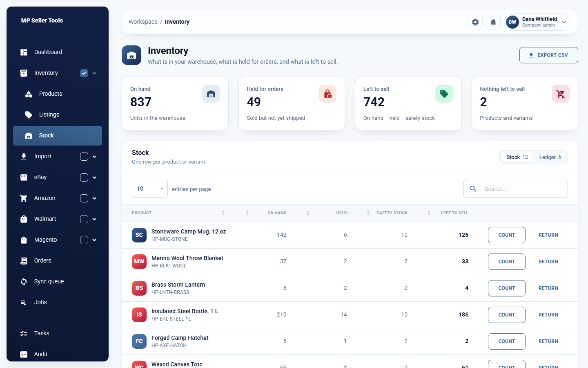 **Stock** — on hand, held for orders, left to sell |
| 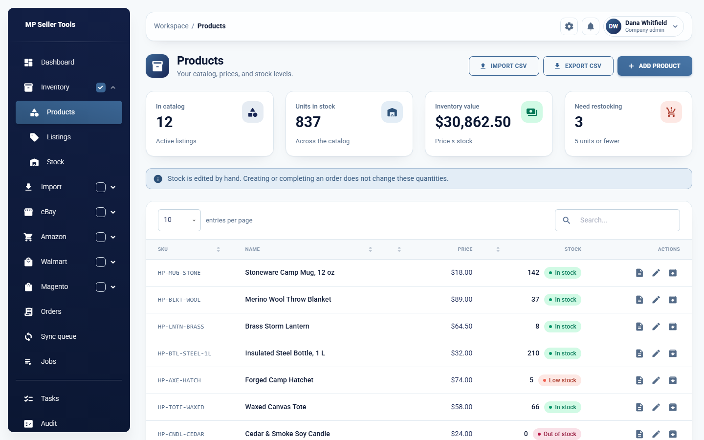 **Products** — the company's catalog | 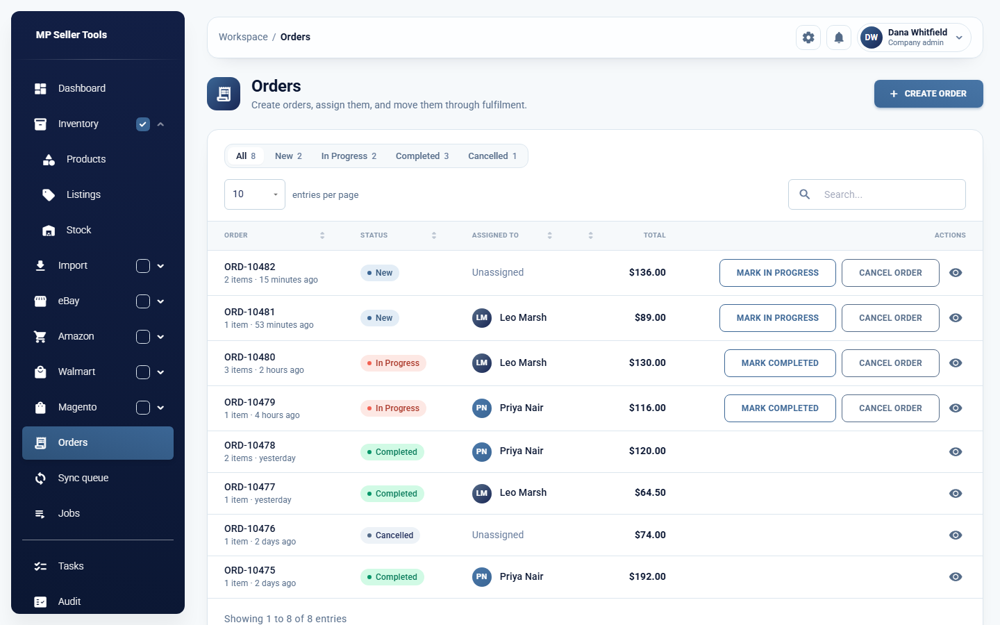 **Orders** — every channel in one list |
| 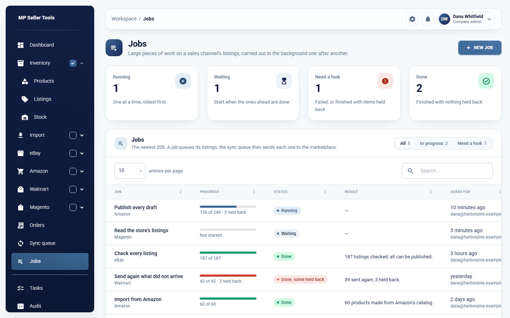 **Jobs** — background work on a channel's listings | 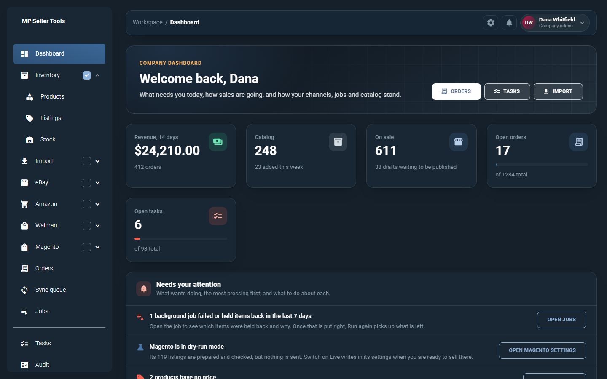 **Dark mode** — every theme has one |
| 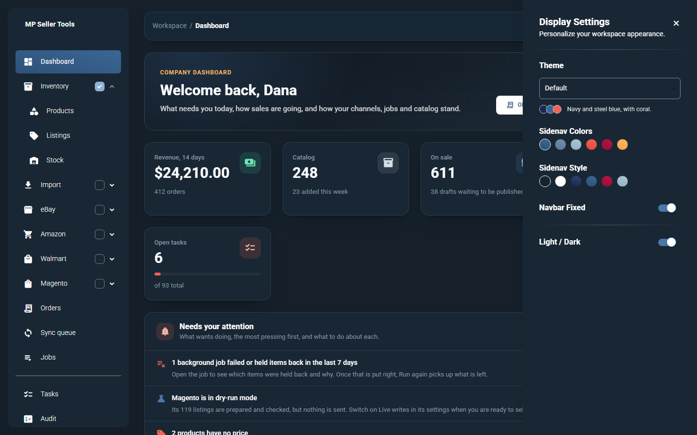 **Display settings** — themes and sidebar colours | 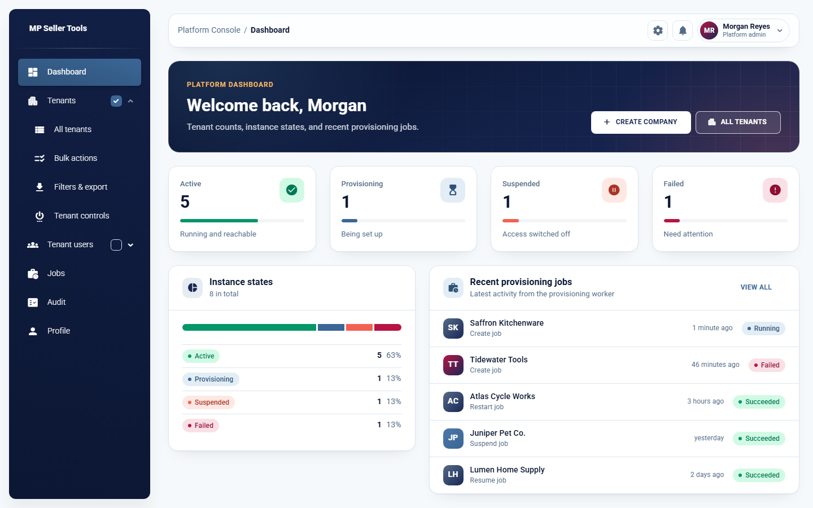 **Platform console** — every company at a glance |

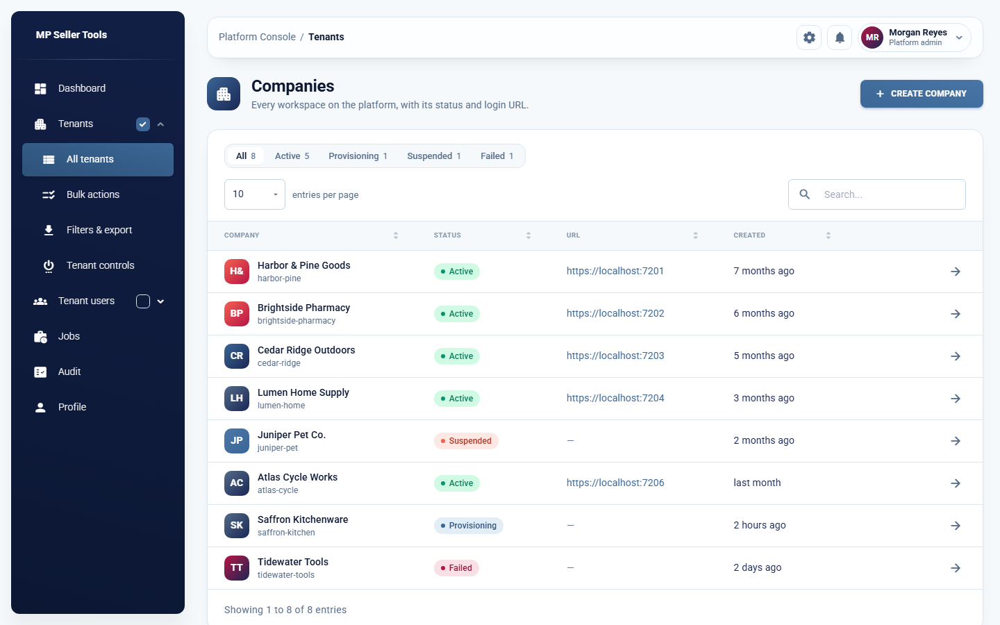

## How it fits together

```
DevHost (local launcher)
├── PlatformHost            https://localhost:7100   platform API + console
│     └── MPSellerTools_Platform database (registry of companies, jobs, audit)
└── Provisioning.Worker     no port                  runs the job queue
      ├── TenantHost: Company A   https://localhost:7201   own database
      ├── TenantHost: Company B   https://localhost:7202   own database
      └── …one process and one database per company
```

- **PlatformHost** never opens a company's database. To manage a company's
  users it calls that company's instance with a per-company access key.
- **Provisioning.Worker** takes jobs from the platform database, creates and
  migrates a company's database, and starts or stops its **TenantHost**.
- **TenantHost** is one compiled binary; each running copy is bound to exactly
  one company for the lifetime of the process.

[`docs/architecture.md`](docs/architecture.md) has the full diagrams and flows.

## Tech stack

| Layer | Built with |
| --- | --- |
| Backend | ASP.NET Core on .NET 10, EF Core, ASP.NET Core Identity |
| Database | SQL Server — one platform database, one database per company |
| Frontend | React 19, TypeScript, Vite, MUI |
| Tests | xUnit (unit + integration against real databases), Playwright |
| Tooling | PowerShell 7 scripts for setup, build, start, stop and verify |

## Quick start

On Windows, with the .NET 10 SDK, SQL Server, Node.js 20+ and PowerShell 7+:

```powershell
.\scripts\Setup-Dev.ps1     # one-time: migrations, the first administrator, two demo companies
.\scripts\Start-Dev.ps1     # starts the platform, the worker and every active company
```

Then open https://localhost:7100/login and sign in with the account written to
`.local/platform/dev-admin-credentials.txt`. `.\scripts\Stop-Dev.ps1` stops
everything.

[`docs/local-development.md`](docs/local-development.md) covers prerequisites,
scripts, ports, accounts, configuration, reaching it from another machine and
troubleshooting.

## Tests

```powershell
.\scripts\Verify.ps1        # build, lint, typecheck and backend tests, with a summary
```

UI checks and the README's screenshots run against mocked API responses, so
they need no backend — from `tests/e2e`: `npm run test:ui` and
`npm run screenshots`.

## Status

A local development setup, not production-hardened. A new sales channel
account sends nothing until it is switched on, and most marketplace adapters
have only been run against in-process fakes — only the Magento connection has
been tried against a real store. See
[local isolation limitations](docs/local-development.md#local-isolation-limitations)
and [security notes](docs/local-development.md#security-notes) before exposing
it to anyone.

## Documentation

| Document | Covers |
| --- | --- |
| [`docs/local-development.md`](docs/local-development.md) | Setup, scripts, ports, accounts, configuration, troubleshooting, security notes |
| [`docs/architecture.md`](docs/architecture.md) | Components, databases, process tree, provisioning / suspend / resume / delete flows |
| [`docs/multichannel-catalog.md`](docs/multichannel-catalog.md) | Catalog and listing data model and how sync works |
| [`docs/marketplace-operations.md`](docs/marketplace-operations.md) | Running the multichannel catalog: configuration, going live, rollback |
| [`docs/marketplace-integrations.md`](docs/marketplace-integrations.md) | What was verified against each marketplace's documentation |
| [`docs/windows-deployment.md`](docs/windows-deployment.md) | Guidance for a real Windows Server deployment |
| [`docs/template-adaptation.md`](docs/template-adaptation.md) | What was taken from the UI template and what was changed |

## Third-party code

`frontend/packages/ui/` is adapted from Creative Tim's Material Dashboard 2
React (MIT License, Copyright (c) 2019 Creative Tim). See
[`THIRD-PARTY-NOTICES.md`](THIRD-PARTY-NOTICES.md). The project itself has no
licence file.
