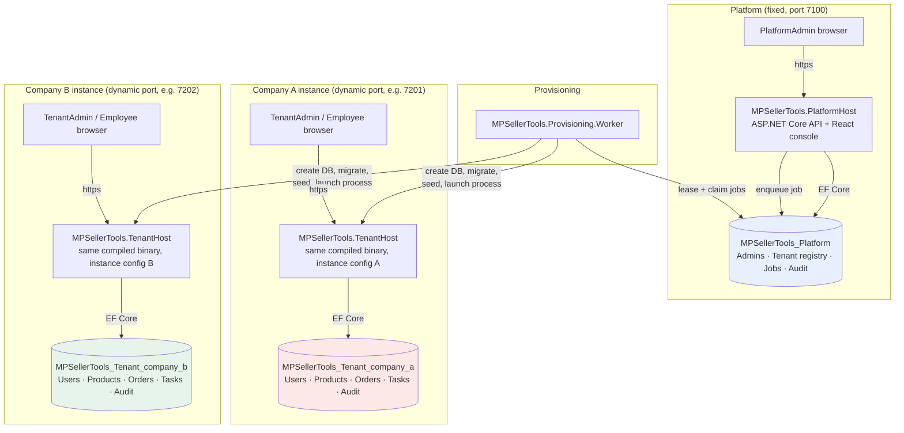
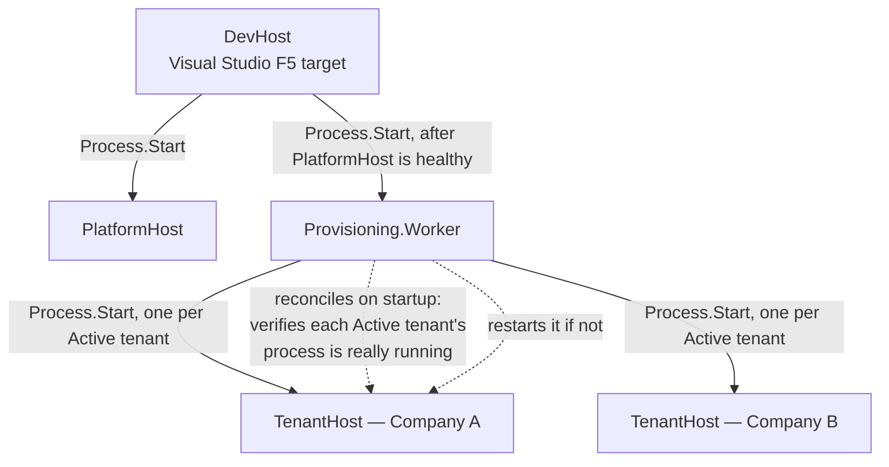
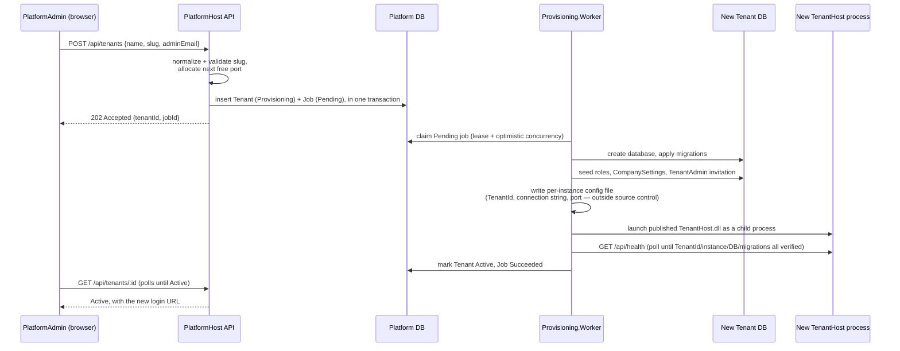

# Architecture

MPSellerTools follows a **Multiple Application, Multiple Database**
multi-tenant architecture (see
[Frontegg's overview](https://frontegg.com/guides/multi-tenant-architecture#How_Does_Multi-Tenancy_Work_3_Types_of_Multi-tenant_Architecture)):
each company runs its own application process against its own database,
under a common platform that provisions and manages them.

## Component and database diagram

Key properties this diagram is meant to make visible:

- **PlatformHost and every TenantHost are separate OS processes**, each with
  its own connection string, cookie name, antiforgery cookie name, and Data
  Protection key directory — never a single process that switches database
  based on a request header, tenantId, or JWT claim.
- **TenantHost's own code is identical for every company** — Company A and
  Company B run the exact same compiled `MPSellerTools.TenantHost.dll`,
  differing only in the immutable per-instance configuration file each
  process is launched with (`TenantId`, `ApplicationInstanceId`, `Slug`,
  connection string, port).
- **The platform database never contains business data.** It holds platform
  administrators, the company registry (`Tenants`), the provisioning job
  queue, and platform-level audit entries only.
- **Each tenant database is fully self-contained**: its own ASP.NET Core
  Identity users/roles (so the same email address can exist independently in
  two different companies), its own business tables, its own audit log.

## Platform access to tenant users

The platform console's **Tenant users** menu lets a PlatformAdmin list every
company's users and invite, edit (name and sign-in email), delete, block,
unblock, change the role of, sign out, set a password for, or force a
password reset for any of them. This goes beyond the original brief (§5,
which limited the platform to the initial administrator invitation); it was
added on request, and it is built so the isolation rules above still hold:

- **The platform is given no tenant connection string and stores no tenant
  user data.** `PlatformHost` calls the company's own `TenantHost` over HTTPS
  (`/api/users…`), which answers from its own database. Nothing that comes
  back is written to the platform database.
- **Each tenant has its own platform access key**, a random secret the
  `TenantHost` creates on first start at
  `.local/tenants/<slug>/platform-access.key`. The platform reads that file
  and sends the key in an `X-Platform-Key` header. One company's key is
  useless against another company.
- **The key opens user management only.** A caller holding it is a
  `PlatformOperator`, a role accepted by the `UserManagement` policy on
  `UsersController` and by nothing else — products, orders, tasks, settings,
  invitations and the audit log still answer 401
  (`PlatformAccessTests`).
- **The tenant's own rules still apply**, such as refusing to block, demote
  or delete its last active TenantAdmin, or to delete a user who still has
  unfinished tasks.
- **A user is added by invitation** (`POST /api/users/invite`); the new user
  sets their own password. A PlatformAdmin can instead *create* one straight
  away (`POST /api/users`, refused to a TenantAdmin) with a password that is
  shown once in the console to pass on.
- **Passwords are never readable.** They are stored only as a hash, so no
  screen can show an existing one. A PlatformAdmin can *set* a new password
  (`POST /api/users/{id}/set-password`, refused to a TenantAdmin), which is
  shown once in the console to pass on and is not logged or stored there.
- **Both sides record it.** The tenant's audit log shows the actor as
  `platform:<admin email>`; the platform audit log gets a `TenantUser…`
  entry.

Only Active companies can be reached; a suspended or stopped company is
listed in the console as unavailable. In local development the key file is
readable by the single Windows user running everything. In production, give
the platform's identity read access to each key file (or move the keys to a
secret store) and nothing else in the tenant's directory.

## eBay integration

Each company links its own eBay seller account from **eBay** in its workspace
(TenantAdmin only). The link lives in that company's database
(`EbayConnections`, one row) and its calls are made by that company's
TenantHost, so one company's eBay access is never available to another.

- **Keys.** The TenantAdmin enters the App ID, Cert ID and RuName of an eBay
  developer keyset, and chooses Sandbox or Production. The Cert ID and the
  seller's refresh token are stored encrypted with the instance's data
  protection keys and are never returned by the API.
- **Consent** is eBay's OAuth authorization code grant. `POST
  /api/ebay/connect` returns eBay's consent address with a random `state`;
  eBay sends the seller back to the workspace page `/ebay`, which posts its
  own address to `POST /api/ebay/complete`. The server checks the `state`,
  exchanges the code and keeps the refresh token. (eBay is not sent to an API
  address because the session cookie is SameSite=Strict.) The RuName's
  "auth accepted URL" on eBay must be `https://<workspace>/ebay`.
- **Scopes are read-only**: `sell.fulfillment.readonly` and
  `sell.inventory.readonly`, with eBay's basic `api_scope` for the Trading
  API call below. Nothing here changes a listing or an order on eBay.
- **Importing orders** (`POST /api/ebay/import/orders`) reads the Fulfillment
  API's `getOrders` for orders changed since the last import (90 days back the
  first time). A new one becomes an order numbered `EBAY-<order id>`, with a
  product created for any SKU not in the catalog; one imported before only has
  its status updated. `Orders.EbayOrderId` is unique, so an order is never
  imported twice.
- **Importing products** (`POST /api/ebay/import/products`) reads the
  Inventory API's `getInventoryItems` and each item's offer price, matched by
  SKU. The Inventory API only returns items listed through it, so the import
  then reads everything on sale with the Trading API's `GetMyeBaySelling`
  (`ActiveList`, called with the OAuth token in `X-EBAY-API-IAF-TOKEN`). A
  listing made on the eBay site is filed under the product with its SKU, or
  under a new product (`EBAY-<item number>` when it has no SKU); a product
  already in the catalog is not changed by it.
- **Listings** (`GET /api/listings`, the workspace's **Listings** page, open
  to employees too) are the products posted for sale. The product import
  records each item's *published* offers in `Listings`, keyed by channel and
  eBay's item number, with the marketplace, price, available and sold
  quantities, status (Live / Out of stock / Ended) and the item's public
  address, and the same for each listing `GetMyeBaySelling` reports. A
  listing eBay no longer reports is removed; one whose offers eBay could not
  be asked about that time is left as it was. When `GetMyeBaySelling` itself
  is refused, nothing is removed, and the import succeeds with a `warning`
  that is also kept as the connection's last error. `Listings.Channel`
  exists so another e-commerce site can be added beside eBay.
- **Imports are run by hand** from the page; there is no background schedule.
  A refusal from eBay is shown as eBay worded it and kept as the link's last
  error.

Covered by `EbayIntegrationTests`, with a stand-in for eBay's HTTP API; no
test calls eBay.
## Local dev-mode process tree

DevHost, PlatformHost, and the Worker share DevHost's console, so a single
Ctrl+C in that console propagates via normal Windows console signal
delivery to all of them — and, because the worker launches TenantHost
without `CREATE_NEW_PROCESS_GROUP`, to every tenant process too.

## Provisioning flow (creating a company)

## Suspend / Resume

Suspend verifies the tenant's recorded process (PID **and** start time — a
bare PID is not sufficient, since the OS reuses them) and terminates it,
which genuinely removes access (the port stops listening). Resume relaunches
the same published binary with the same instance config, re-verifies
readiness via `/api/health`, and marks the tenant Active again with the same
`ApplicationInstanceId`. Supervision state (`Tenant.ProcessId` /
`ProcessStartTimeUtc`) lives in the platform database, not in the worker's
memory, so a worker restart (or this whole machine rebooting) can always
tell which tenants it needs to bring back — see `ReconcileActiveTenantsAsync`
in `MPSellerTools.Provisioning.Worker`.

## Delete

Deleting a company is permanent. `DELETE /api/tenants/{id}?confirmSlug=<slug>`
refuses unless the slug is repeated back, and refuses a company that is still
Provisioning or already Deleting. It marks the tenant Deleting and queues a
`Delete` job; the worker then stops the verified process, drops the tenant's
database, removes `.local/tenants/<slug>`, and deletes the tenant row together
with its jobs. Every step is a no-op when already done, so a failed delete
(the tenant shows Failed with the reason) can simply be requested again. The
platform audit log keeps `TenantDeleteRequested` and `TenantDeleteSucceeded`
with the slug and name, since the row they refer to is gone.
