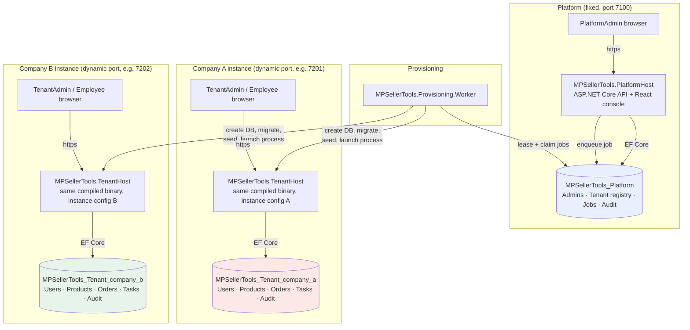
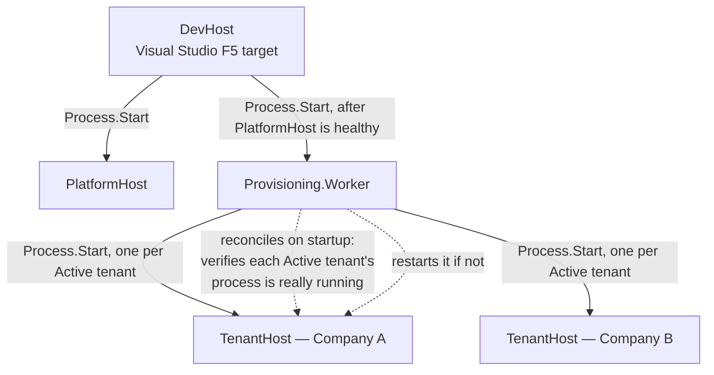
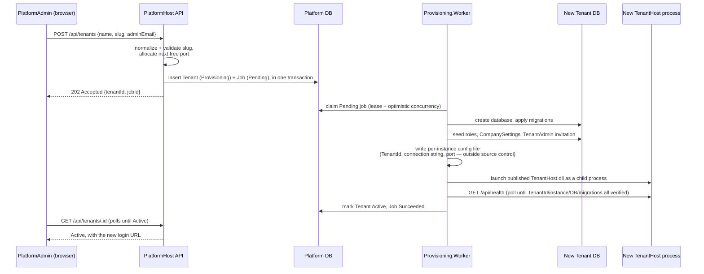

# Architecture

MPSellerTools follows a **Multiple Application, Multiple Database**
multi-tenant architecture (see
[Frontegg's overview](https://frontegg.com/guides/multi-tenant-architecture#How_Does_Multi-Tenancy_Work_3_Types_of_Multi-tenant_Architecture)):
each company runs its own application process against its own database,
under a common platform that provisions and manages them.

## Component and database diagram

Key properties this diagram is meant to make visible:

- **PlatformHost and every TenantHost are separate OS processes**, each with
  its own connection string, cookie name, antiforgery cookie name, and Data
  Protection key directory — never a single process that switches database
  based on a request header, tenantId, or JWT claim.
- **TenantHost's own code is identical for every company** — Company A and
  Company B run the exact same compiled `MPSellerTools.TenantHost.dll`,
  differing only in the immutable per-instance configuration file each
  process is launched with (`TenantId`, `ApplicationInstanceId`, `Slug`,
  connection string, port).
- **The platform database never contains business data.** It holds platform
  administrators, the company registry (`Tenants`), the provisioning job
  queue, and platform-level audit entries only.
- **Each tenant database is fully self-contained**: its own ASP.NET Core
  Identity users/roles (so the same email address can exist independently in
  two different companies), its own business tables, its own audit log.

## Local dev-mode process tree

DevHost, PlatformHost, and the Worker share DevHost's console, so a single
Ctrl+C in that console propagates via normal Windows console signal
delivery to all of them — and, because the worker launches TenantHost
without `CREATE_NEW_PROCESS_GROUP`, to every tenant process too.

## Provisioning flow (creating a company)

## Suspend / Resume

Suspend verifies the tenant's recorded process (PID **and** start time — a
bare PID is not sufficient, since the OS reuses them) and terminates it,
which genuinely removes access (the port stops listening). Resume relaunches
the same published binary with the same instance config, re-verifies
readiness via `/api/health`, and marks the tenant Active again with the same
`ApplicationInstanceId`. Supervision state (`Tenant.ProcessId` /
`ProcessStartTimeUtc`) lives in the platform database, not in the worker's
memory, so a worker restart (or this whole machine rebooting) can always
tell which tenants it needs to bring back — see `ReconcileActiveTenantsAsync`
in `MPSellerTools.Provisioning.Worker`.
