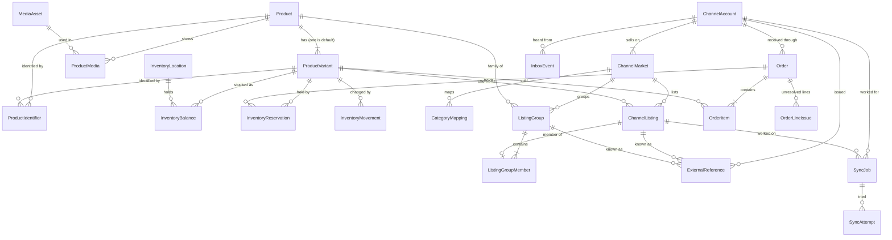

# Multichannel catalog — design note

One catalog, edited in one place, offered on Amazon, eBay, Walmart and the
company's own website. This note covers the data model, who owns which data,
and how changes reach the channels. Running it day to day is in
[`marketplace-operations.md`](marketplace-operations.md); what was checked
against each marketplace's documentation is in
[`marketplace-integrations.md`](marketplace-integrations.md).

Status: implemented and covered by automated tests against fakes of the
channel APIs. **No call has been made to any real marketplace API, sandbox
or production** — no credentials were available. Do not read "tests pass" as
"works against Amazon/eBay/Walmart".

## What was there, and what it became

The project is an ASP.NET Core 10 / EF Core 10 / SQL Server application with
one process and one database per company (`docs/architecture.md`). Tenant
isolation is the database itself: there is no `tenant_id` column anywhere,
and none was added. Everything below lives in the tenant database and runs
inside the tenant's own `TenantHost` process.

| Logical entity | Before | Now |
| --- | --- | --- |
| products | `Product` (SKU, name, price, stock) | `Product` extended with `Brand`, `Description`, `Category` |
| product_variants / sellable SKU | none — a product *was* its SKU | new `ProductVariant`; every product has a default variant carrying the product's own SKU. New-condition only today, so variant = sellable unit; `Condition` is a column, so a used unit would be its own variant with its own stock |
| product_identifiers | none | new `ProductIdentifier` (GTIN/UPC/EAN/ISBN/MPN as text, owned by a product or a variant) |
| media_assets + associations | none (no file storage in the project) | new `MediaAsset` (URL + alt text) and `ProductMedia` (position, purpose). Images stay wherever they are hosted |
| channel_accounts | `EbayConnection` (single row: keys + consent) | new `ChannelAccount`. The eBay account *uses* `EbayConnection` for its secrets — they are not copied. Amazon/Walmart credentials are encrypted on the account |
| channel_markets | `Listing.Marketplace` text | new `ChannelMarket` (marketplace code, language, currency) |
| category mapping | none | new `CategoryMapping` with the requirements snapshot, its source and version |
| channel_listings | `Listing` — read-only snapshot of what eBay reported | new `ChannelListing` (desired + observed + versions). `Listing` is **kept as is**: it remains the read model of the manual eBay import and still backs `/api/listings` |
| listing_groups + members | none | new `ListingGroup`, `ListingGroupMember` (per marketplace) |
| external_references | `Listing.ExternalId`, `Order.EbayOrderId` | new `ExternalReference` (typed, scoped to account/market). The two legacy columns stay |
| inventory_locations / pools | none | new `InventoryLocation`; `MAIN` warehouse is seeded |
| inventory balances, reservations, movements | `Product.StockQuantity`, edited by hand | new `InventoryBalance`, `InventoryReservation`, `InventoryMovement` |
| orders, order_lines | `Order`, `OrderItem` | extended: `ChannelAccountId`, `ExternalOrderId`, `Currency`; `VariantId`, `ExternalLineId`, `SellerSku`. New `OrderLineIssue` for lines that cannot be mapped or reserved |
| outbox, sync jobs, attempts, inbox | none in the tenant database | new `OutboxEvent`, `SyncJob`, `SyncAttempt`, `InboxEvent`. The claim/lease pattern is the one the provisioning worker already uses for its jobs |
| audit | `AuditEntry` | reused; the worker writes entries as `system` |

Nothing was renamed or dropped. The migration `AddMultichannelCatalog` only
adds tables, nullable columns and indexes.

### Legacy data found

- **Products without SKUs:** none possible — `Product.Sku` is required and unique.
- **Duplicate SKUs:** none possible within a database (unique index). A
  *variant* SKU colliding with another product's SKU is reported by the
  backfill as a conflict and left alone.
- **External identifiers already in use:** `Order.EbayOrderId` and
  `Listing.ExternalId` (eBay item numbers). Both are preserved. An order
  first imported the old way is *adopted* (given its account and
  `ExternalOrderId`) when it arrives again; it is never duplicated. Legacy
  `Listing` rows are not turned into `ChannelListing`s: they describe
  listings that may have been made outside the Inventory API, which that API
  cannot manage (see the integrations note), so no mapping is invented.

## Entity relationships



Uniqueness that matters:

| Constraint | Why |
| --- | --- |
| `ProductVariant.Sku` unique | the internal SKU is stable and unambiguous |
| one default variant per product (filtered unique index) | the backfill and a concurrent product edit cannot both create it |
| `ChannelListing (ChannelMarketId, VariantId)` unique | one offer of a variant per marketplace |
| `ChannelListing (ChannelMarketId, SellerSku)` unique | a seller SKU names one offer *within a marketplace*; the same SKU on another marketplace is another offer |
| `ExternalReference (OwnerType, OwnerId, ResourceType)` unique; **value not unique** | one eBay listing id belongs to every variant sold through that listing |
| `Order (ChannelAccountId, ExternalOrderId)` unique | an order id is only unique within the account that issued it |
| `InventoryReservation.IdempotencyKey` unique | an order or event delivered twice holds its units once |
| one *pending* `SyncJob` per listing and operation (filtered unique index) | further changes raise that job's target instead of queueing more |

Internal SKU, seller SKU, GTIN, ASIN, offer id and listing id are separate
columns/rows throughout; none is used in place of another.

## Who owns what

| Data | Owner | Notes |
| --- | --- | --- |
| Product content, variants, identifiers, images | this backend | no ERP or PIM exists in the project |
| Variant price | this backend (`ProductVariant.Price`) | `Product.Price` is the default variant's price, kept in step |
| Merchant stock | this backend (`InventoryBalance` at `MAIN`) | `Product.StockQuantity` is the default variant's on-hand, kept in step |
| FBA / WFS stock | the channel | a separate `InventoryLocation` kind, externally owned; never written from here, and a channel-fulfilled listing is never sent a quantity. Their lifecycle is out of scope |
| Listing content, price, quantity cap | this backend | per-field overrides on top of the product |
| Listing *status*, issues, observed price/quantity | the channel | only ever written from what the channel reported |
| eBay keys and consent | `EbayConnection` | unchanged |

`Product.Sku/Price/StockQuantity` and the default variant are the same facts
in two places during the transition. They are tied together in exactly one
place — `CatalogSaveChangesInterceptor`, which runs inside every
`SaveChanges` of the tenant context — so no code path can update one without
the other, and both commit or roll back together. The inventory service does
the reverse step (variant balance → product column) in the same transaction
when stock ships or is returned.

### Field ownership when the channel disagrees

Each account has a `PriceConflictPolicy`, applied by reconciliation when the
channel's price differs from the managed one *and nothing is in flight*:

- `ReportConflict` (default): change nothing, set `HasPriceConflict`.
- `RestoreLocal`: send the local price again.
- `ImportRemote`: take the channel's price as the listing's override; nothing is sent back.

Each acts once per difference found, so the two sides cannot overwrite each
other in a loop.

## Content: inherit, override, clear

A listing's effective content is the product and variant, with the listing's
overrides on top (`ListingComposer`). For `title`, `description` and `brand`
an override is stored per field as JSON and has three distinct states:

| Stored | Meaning | API |
| --- | --- | --- |
| field absent | inherit the product's value | `"title": null` |
| `{"value":"…"}` | use this value | `"title": {"value":"…"}` |
| `{"cleared":true}` | deliberately send it empty | `"title": {"cleared":true}` |

Changing the product never touches an override. Category-specific attributes
are a JSON object on the listing; everything relational (keys, prices,
quantities, states, versions) is typed columns. Money is `decimal(18,2)` with
a currency; nothing is stored as floating point.

Validation runs before anything is sent (`ListingValidator` + each adapter's
own checks): required fields, units, the category's required attributes,
conditional requirements and allowed values. Issues carry channel, field
path, code and message. A listing that does not validate cannot be published
on *that* channel; nothing else is blocked. Local validation is a pre-check,
not a substitute for the channel's own.

## Three kinds of state, never merged

| | Column(s) | Written by |
| --- | --- | --- |
| Desired | `DesiredState`, overrides, `ContentVersion` / `PriceVersion` / `InventoryVersion` | the user (via the dispatcher) |
| Observed | `ObservedStatus`, `ObservedPrice`, `ObservedQuantity`, `IssuesJson`, `Confirmed*Version` | the channel's answers only |
| Operation | `SyncJob.Status`, `SyncAttempt` | the worker |

`ObservedStatus = Live` means the channel reported the item buyable. An HTTP
200, Amazon's `ACCEPTED`, a Walmart feed id or a Walmart `SUCCESS` ingestion
all leave it at `Processing`.

## From a change to the channel

```mermaid
sequenceDiagram
    participant U as Admin API
    participant DB as Tenant DB
    participant W as Sync worker
    participant C as Channel
    U->>DB: save change + OutboxEvent (one transaction)
    U-->>U: 200/202 — no channel call
    W->>DB: dispatch events → bump versions, upsert pending SyncJob
    W->>DB: claim job (atomic UPDATE … OUTPUT, lease)
    W->>C: look up, then create/update
    C-->>W: accepted / confirmed / refused
    W->>DB: record attempt; confirm only if version is newer
    W->>C: (later) poll final status
```

- **Outbox.** The interceptor writes an `OutboxEvent` for catalog, price and
  stock changes in the same `SaveChanges`; controllers add listing events
  explicitly. No HTTP call to a channel happens inside a request.
- **Jobs carry no payload.** A job sends the listing's *current* desired
  state when it runs. A burst of changes collapses into one pending job.
- **Claiming** is one `UPDATE … OUTPUT` over a `READPAST` CTE, so two workers
  cannot take the same job. A listing with a running job is skipped, so its
  operations run one at a time.
- **Leases.** A running job whose lease expired is put back; what the dead
  worker got done is unknown, which is why creation always looks first.
- **Stale answers.** `Confirmed*Version` is advanced by an `UPDATE … WHERE
  Confirmed < @version`; an answer for an older version changes nothing.
- **Retries.** Transient errors back off (30 s doubling to 1 h, +0–25 %
  jitter, honouring `Retry-After`) up to `MaxAttempts`. Authorization errors
  fail at once and are recorded on the account. Data errors become
  `NeedsCorrection` with the issues on the listing. Everything else fails.
- **Priority.** Inventory 100 > Deactivate 80 > OrderImport 60 > Price 50 >
  Content 10. Content, price and inventory are separate operations.
- **Batches.** Where a channel takes several items per call (eBay price and
  quantity: 25; Walmart item feed: 50 here) jobs are claimed together and
  answered one by one, so a refused item fails alone.
- **Rate limits** are honoured reactively (`Retry-After`, backoff). There is
  no proactive per-API token bucket yet — see the checklist.

## Inventory

```text
available_to_sell = max(0, on_hand - reserved - safety_stock)
```

| Event | on_hand | reserved |
| --- | --- | --- |
| reserve | — | + |
| ship | − | − |
| release (cancel, expiry) | — | − |
| return **received** at the warehouse | + | — |
| manual count | set | — |

Balances change through conditional `UPDATE` statements
(`… WHERE OnHand - Reserved - SafetyStock >= @q`), so two requests for the
last unit cannot both succeed. Every change is keyed: reservations by
`order:{orderId}:{lineId}`, returns by the warehouse receipt reference.
Orders created here and orders imported from a marketplace go through the
same `InventoryService`. A buyer's checkout honours safety stock; an order a
marketplace has already taken does not (those units are sold), and one that
cannot be covered is still imported and flagged as an `InventoryShortfall`.

**Overselling.** The quantity sent to each channel is the full shared
`available_to_sell`, capped by the listing's own `QuantityCap` if set. With
the same stock advertised on several channels and their APIs asynchronous,
two channels can sell the last unit before either hears of the other's sale.
Safety stock and per-listing caps reduce that risk; nothing here eliminates
it. A strict allocation (the caps summing to at most the available stock,
with decreases confirmed on one channel before increases on another) is not
automated — caps are set by hand.

Stock is sent to a marketplace only when inventory accounting is on *and*
every active marketplace account imports its orders. An account whose orders
have not been read for `OrderStaleMinutes` is shown as stale in the health
endpoint.

## Migration: expand → backfill → switch → cleanup

1. **Expand** — `AddMultichannelCatalog`: new tables and nullable columns
   only. The old API and screens work unchanged. On a database that has not
   had the migration, the interceptor does nothing and the worker stands by.
2. **Backfill** — `CatalogBackfill` gives each old product its default
   variant and balance and links old order lines. Batched, each batch its own
   transaction, selecting only what is still missing, so it can be stopped
   and re-run. `dryRun` reports without writing. Conflicts are reported, not
   resolved. It publishes nothing and creates no external id. A product
   edited while it runs gets its variant from that save; the unique index
   makes whichever comes second a no-op.
3. **Switch** — `InventoryAccountingEnabled`, by configuration, per host
   (orders start holding and deducting stock), and each account's own live
   writes switch (its operations stop being dry runs). The host's
   `LiveWritesEnabled` is on unless an operator turns it off for everyone.
4. **Cleanup** — not done, on purpose. `Product.Price`, `Product.StockQuantity`,
   `Order.EbayOrderId` and the `Listings` table all stay.

Rolling back behaviour is turning the flags off: orders stop touching stock
and every operation becomes a dry run again. Data already collected
(variants, balances, reservations, listings, job history) is left in place;
removing it would be a separate, destructive step that nothing here performs.

## Deliberately not built

- A storefront, cart or checkout — the project has none. The website is a
  channel with its own content, price and visibility, and
  `/api/storefront/products` is the read projection a storefront would use.
- Inbound webhooks/notifications. State is polled; `InboxEvent` is in the
  schema for deduplicating them when they are added.
- The FBA/WFS lifecycle, a rules engine, multi-seller SaaS features.
- A workspace UI for category mappings, listing groups and per-listing
  overrides; those stay API-only. Listings, account settings, the sync queue
  and inventory have pages (see `marketplace-operations.md`).
